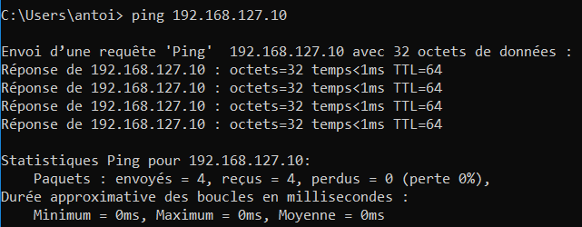

# B1-reseau-tp3

# I.Création et utilisation simples d'une VM CentOs    

## 1 à 4 vu et fait en cours

## 5.Faire joujou avec quelques commandes
  
A faire :  
* on fait un `ping` hôte --> VM :  

* on fait un `ping` VM --> hôte :
Pour cela on écrit `ping 10.33.1.54` et on obtient 5 packets transmitted, 15 received, 0% packet lost.

* Afficher la table de routage :  
De l'hôte : Il faut écrire `route print`.   
De la VM : Il faut écrire `ip route`.  
La ligne qui leur permet de discuter via le réseau host-only est l'adresse de réseau.

* On écrit `curl www.google.com` pour télécharger le fichier google.

* Pour télécharger dig sur centOS il faut faire `sudo yum install bind-utils`.
On possède désormais la commande dig. Maintenant on fait la commande `dig ynov.com`et on obtient son IP : `10.33.10.20`.
On obtient exactement la même en faisant `dig google.com`.

# II.Notion de ports et de SSH
## 1.Exploration des ports locaux
* Utilisation de `ss` : 
On fait un `ss -p -n -l4`, le `-p` permet de connaitre l'application qui ecoute sur ce port, le `-n` permet d'avoir un numéro de port plutot qu'un nom et enfin le `-l4` nous dit qu'il faut se mettre sur l'IPV4 (l=listening).  

## 2.SSH
On connecte putty a notre VM en mettant l'adresse IP de notre VM dans putty, maintenant on contrôle la VM grâce a putty.

 
  